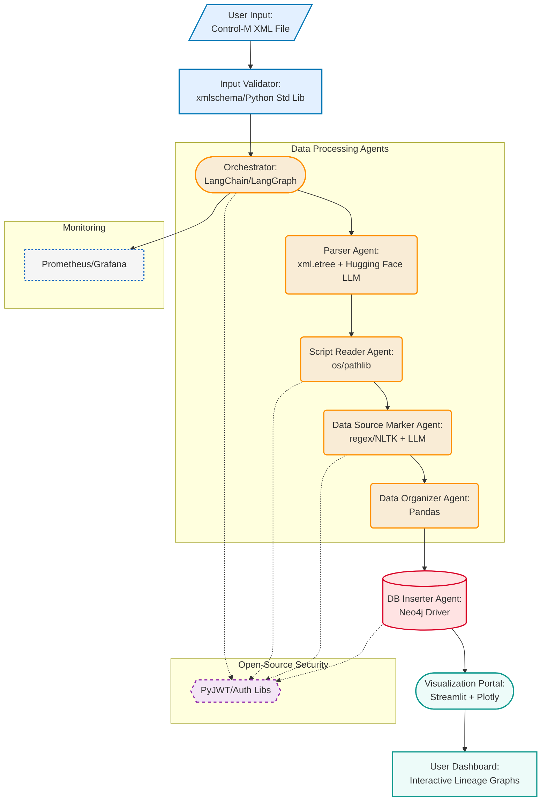

# AI-Driven-Data-Lineage

An AI-powered platform for visualizing data lineage from Control-M XML files, using multi-agent systems and Model Context Protocol (MCP) for automated extraction, analysis, and display. This tool helps data teams trace data flows securely and efficiently, addressing common challenges like accuracy and scalability.

## Motivation
Data lineage is essential for compliance, debugging, and trust in data-driven decisions, but manual tracing is error-prone. This platform automates the process with AI agents, inspired by industry needs in 2025.

## Features
- **Automated Parsing**: Extract jobs and dependencies from Control-M XML.
- **Script Analysis**: Read and mark data sources (DBs/files) via MCP.
- **Data Organization**: Categorize and store lineage in a graph database.
- **Interactive Visualization**: Custom portal for exploring bloodline graphs with filters and exports.
- **Enhanced Security**: RBAC, encryption, and auditing.
- **Scalability**: Distributed agents and caching for large workflows.
- **Integrations**: Compatible with OpenLineage, Neo4j, and more.

## Installation
### Prerequisites
- Python 3.10+
- Docker (for containerized deployment)
- API keys for AI models (e.g., Anthropic) and MCP connectors

### Steps
1. Clone the repo: `git clone https://github.com/yourusername/AI-MCP-DataLineage.git`
2. Install dependencies: `pip install -r requirements.txt`
3. Set environment variables in `.env` (e.g., DB_URL, AI_API_KEY)
4. Build and run: `docker-compose up`

For detailed setup, see [docs/install.md](docs/install.md).

## Usage
1. Upload Control-M XML via the portal or CLI: `python app.py --input path/to/xml`
2. Agents process automatically: Parse > Read Scripts > Mark Sources > Organize > Store.
3. View lineage: Access http://localhost:3000/dashboard for interactive graphs.
4. Customize: Edit `config.yaml` for agent behaviors or integrations.

Example output: A DAG visualization showing job triggers, script flows, and data sources.

For advanced usage, including API endpoints, see [docs/usage.md](docs/usage.md).

## Architecture

The system uses AI agents orchestrated via LangGraph, MCP for secure access, and Neo4j for storage. Shortcomings like AI errors are mitigated with hybrid validation.

## Contributing
We welcome contributions! Fork the repo, create a branch, and submit a pull request. Follow our [code of conduct](CODE_OF_CONDUCT.md).

- Report issues: https://github.com/yourusername/AI-MCP-DataLineage/issues
- Suggest features: Open a discussion.

## Related Projects
- OpenLineage: For standardized lineage capture
- Atlan: AI-driven metadata tools
- Monte Carlo: Data observability

## License
This project is licensed under the MIT License - see the [LICENSE](LICENSE) file for details.
